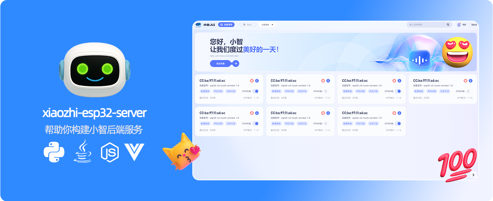

<h1 align="center">小智后端服务xiaozhi-esp32-server</h1>

本项目为开源智能硬件项目
<a href="https://github.com/78/xiaozhi-esp32">xiaozhi-esp32</a>提供后端服务 
根据<a href="https://ccnphfhqs21z.feishu.cn/wiki/M0XiwldO9iJwHikpXD5cEx71nKh">小智通信协议</a>使用Python、Java、Vue实现 
帮助您快速搭建小智服务器

<a href="./README_en.md">English</a>
· <a href="./docs/FAQ.md">常见问题</a>
· <a href="https://github.com/xinnan-tech/xiaozhi-esp32-server/issues">反馈问题</a>
· <a href="./README.md#%E9%83%A8%E7%BD%B2%E6%96%87%E6%A1%A3">部署文档</a>
· <a href="https://github.com/xinnan-tech/xiaozhi-esp32-server/releases">更新日志</a>

  
  
  
  
  
  

---

